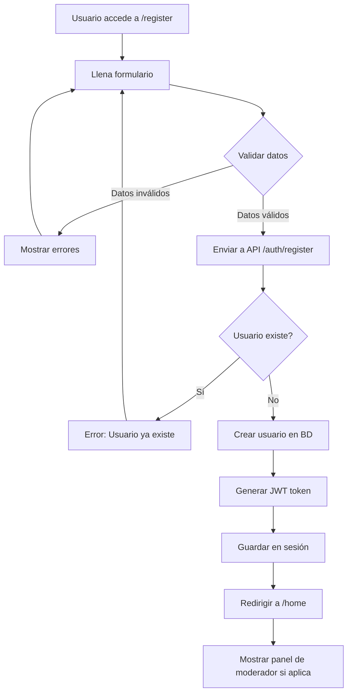
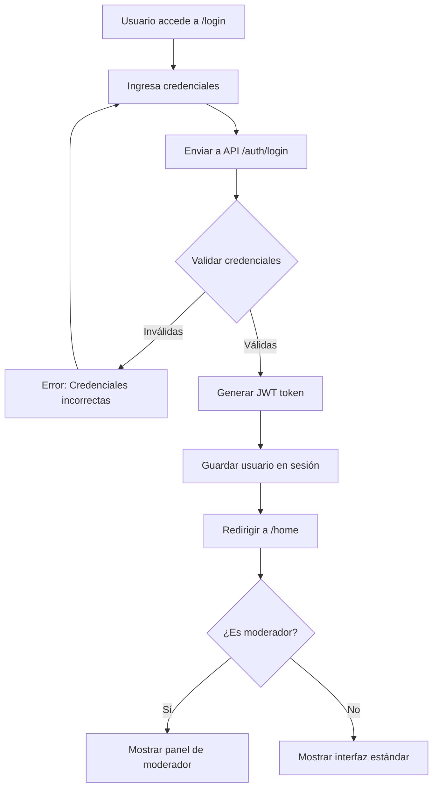
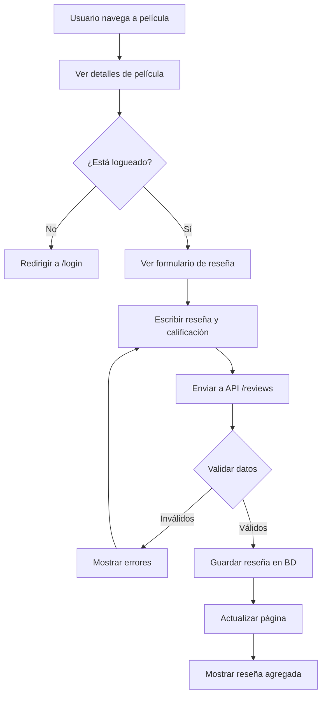
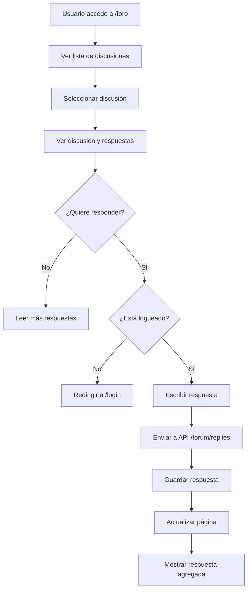
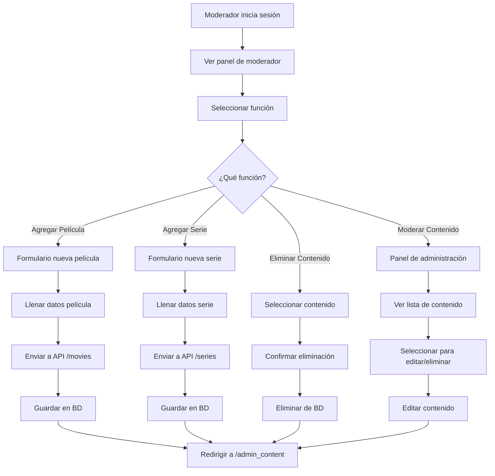
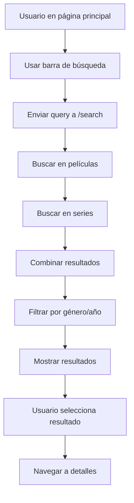
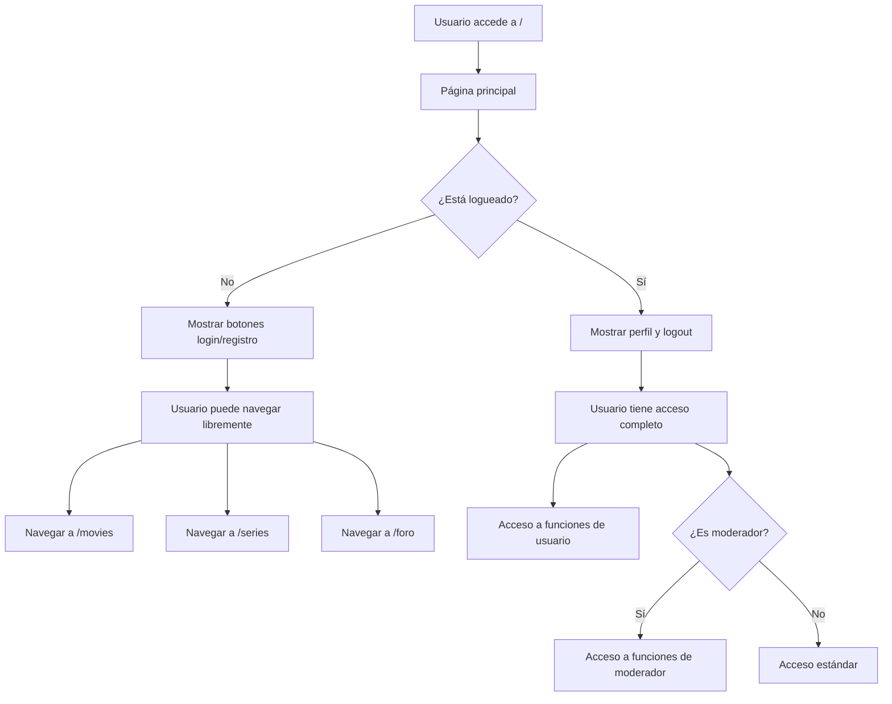
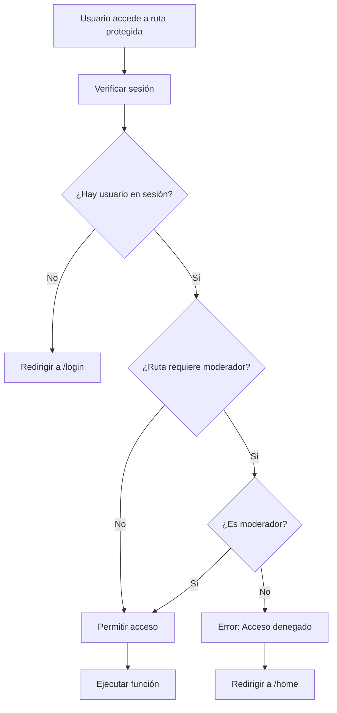

# 🔄 Diagramas de Flujo - PopcornHour

## 📋 Casos de Uso Principales

### 1. 🔐 Registro de Usuario

### 2. 🔑 Inicio de Sesión

### 3. ⭐ Calificar Película

### 4. 💬 Participar en Foro

### 5. 👑 Funciones de Moderador

### 6. 🔍 Búsqueda de Contenido

### 7. 📱 Navegación General

## 🔐 Flujo de Autenticación

### Middleware de Autenticación

## 📊 Estados del Sistema

### Estados de Usuario
- **No autenticado**: Solo navegación básica
- **Usuario estándar**: Reseñas, foro, perfil
- **Moderador**: Todas las funciones + gestión de contenido

### Estados de Contenido
- **Película/Serie**: Activa, editable, eliminable
- **Reseña**: Creada, editable por autor, eliminable por moderador
- **Discusión**: Activa, con respuestas, moderable

## 🔄 Ciclos de Vida

### Ciclo de Vida de Usuario
1. **Registro** → Crear cuenta
2. **Login** → Autenticación
3. **Navegación** → Uso de funciones
4. **Logout** → Cerrar sesión

### Ciclo de Vida de Contenido
1. **Creación** → Por moderador/usuario
2. **Visualización** → Por todos los usuarios
3. **Interacción** → Reseñas, comentarios
4. **Moderación** → Edición/eliminación
5. **Archivado** → Eliminación lógica 